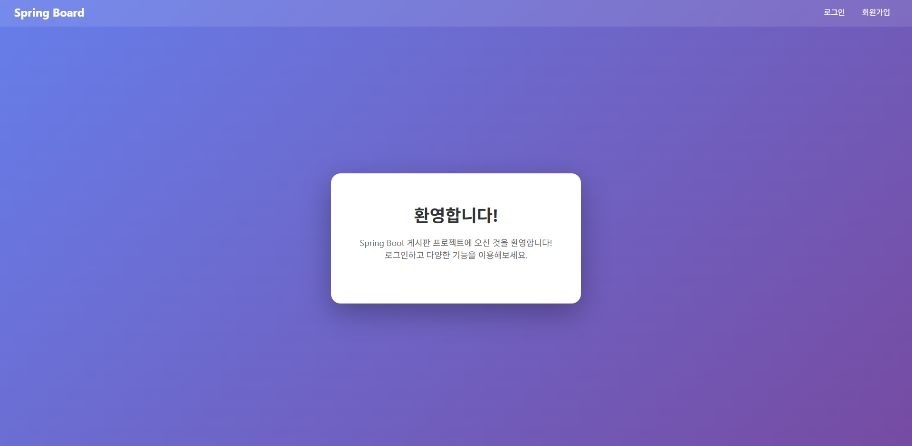
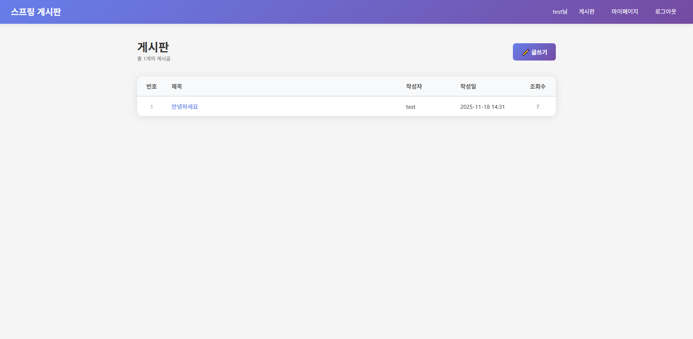
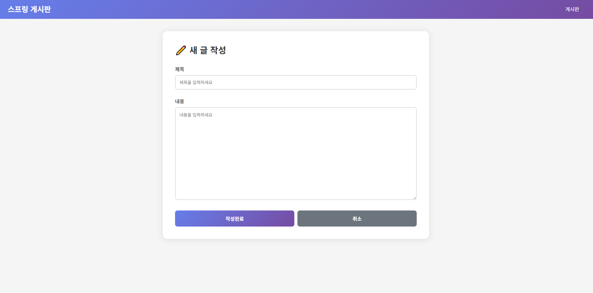
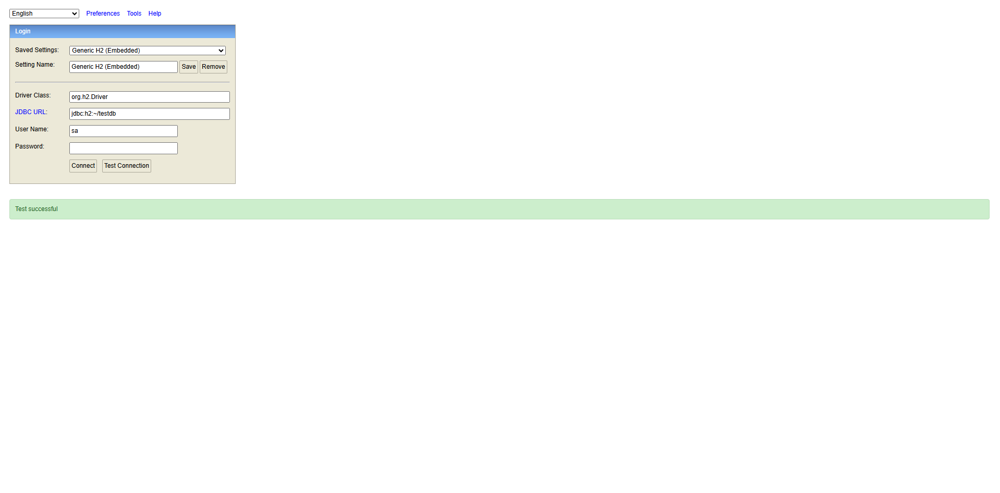

# Spring 게시판(Educational Board) 🌸

Spring Boot 게시판 프로젝트
---

## 핵심 요약
- 프로젝트: 게시판(Spring Boot + Thymeleaf + Spring Data JPA + H2)
- 목적: MVC 아키텍처와 레이어 분리를 보여주기 위한 샘플
- 기본 포트: `8080`

## 데모 스크린샷

<p align="center">
  
</p>

<p align="center">
  
</p>

<p align="center">
  
</p>

<p align="center">
  
</p>

---

## 빠른 시작 (Windows PowerShell)

1) 프로젝트 루트로 이동:

```powershell
cd "c:\Users\2C-20\OneDrive\문서\SpringProjects\demo"
```

2) 실행 (Gradle/Maven Wrapper 사용):

```powershell
# 개발용 실행
.mvnw.cmd spring-boot:run

# 또는 빌드 후 실행
.mvnw.cmd package
java -jar .\target\demo-0.0.1-SNAPSHOT.jar
```

3) 브라우저로 접속: `http://localhost:8080`

4) H2 콘솔 (DB 직접 확인): `http://localhost:8080/h2-console`
   - JDBC URL: `jdbc:h2:~/testdb`
   - 사용자: `sa` (패스워드 없음)

---

## 프로젝트 구조 (중요한 파일들)

`src/main/java/com/example/demo`
- `DemoApplication.java` - Spring Boot 애플리케이션 엔트리
- `entity/` - 도메인 모델 (DB 테이블 매핑)
  - `User.java`, `Post.java`
- `repository/` - DB 접근 계층 (Spring Data JPA)
  - `UserRepository.java`, `PostRepository.java`
- `service/` - 비즈니스 로직 계층 (트랜잭션 포함)
  - `UserService.java`, `PostService.java`
- `controller/` - HTTP 요청을 처리하고 뷰를 반환하는 계층
  - `AuthController.java`, `HomeController.java`, `PostController.java`

`src/main/resources/templates` - Thymeleaf 뷰 템플릿 (`*.html`)

---

## MVC 패턴이 어디에 어떻게 구현되어 있나

- Model (데이터/도메인): 엔티티 `Post`, `User`
  - JPA 어노테이션으로 DB 컬럼 매핑
  - 엔티티 내부에 간단한 비즈니스 메서드(예: `incrementViewCount`, `isAuthor`) 포함

- View (화면 렌더링): `src/main/resources/templates/*.html`
  - Thymeleaf 사용 (서버사이드 템플릿)
  - `Model` 객체에 담긴 데이터를 `${}`로 바인딩

- Controller (요청/응답 흐름): `*Controller.java`
  - HTTP 요청을 받고 적절한 Service를 호출한 뒤 뷰 이름을 반환
  - 세션 관리는 `HttpSession`을 사용 (간단한 예제용)

- Service (비즈니스 계층): `*Service.java`
  - 데이터 검증, 권한 검사, 트랜잭션 경계 설정(@Transactional)
  - Repository와 상호작용하여 DB 상태를 변경

- Repository (영속성 계층): `*Repository.java`
  - `JpaRepository`를 상속하여 CRUD/쿼리 메서드 사용
  - 쿼리 메서드는 메서드 이름으로 SQL 생성 (예: `findByTitleContaining`)

요약: Controller → Service → Repository → DB, 그리고 Controller는 Model을 채워 View에 전달합니다.

---

## 파일 작성 순서

새 기능(예: 게시글) 추가 시 추천 순서:

1. Entity 작성 (`entity/Post.java`) — DB 스키마와 도메인 모델 정의
2. Repository 작성 (`repository/PostRepository.java`) — DB 조회 메서드 정의
3. Service 작성 (`service/PostService.java`) — 비즈니스 로직 구현
4. Controller 작성 (`controller/PostController.java`) — HTTP 엔드포인트 구현
5. View 작성 (`templates/post-list.html`, `post-detail.html` 등) — 화면 구성

이 순서는 의존성을 따라 자연스럽게 코드가 쌓이도록 합니다 (하위 계층 먼저).

---

## 코드에 달아둔 주석

- `controller/*.java` : 각 엔드포인트의 역할, 요청 URL, RESTful 설계, 보안(POST vs GET) 설명
- `service/*.java` : 트랜잭션 경계, 권한 검사, 저장/수정/삭제 흐름 설명
- `entity/*.java` : JPA 매핑, `@PrePersist/@PreUpdate` 사용법, 도메인 메서드(조회수 증가 등)
- `repository/*.java` : 쿼리 메서드 문법과 예제

---

## 포트폴리오용 꾸미기 아이디어

- README: 프로젝트 목표와 본인이 맡은 부분(개선, 리팩토링, UI 등)을 간단히 기술
- UI: Bootstrap이나 Tailwind를 살짝 적용하여 화면을 정돈
- 데이터: 더미 데이터를 seed하거나 초기 SQL 스크립트를 추가
- 테스트: 통합 테스트(Controller 통합, Service 단위)를 추가하여 신뢰성 강조
- 배포: Heroku / Render / Azure App Service에 배포 예시 추가

---

## 보안 및 개선 제안

- 현재 비밀번호는 평문 저장 → 반드시 BCrypt로 해시 저장할 것
- 세션 인증 대신 Spring Security 적용 권장 (권한, CSRF 보호)
- Form validation 강화 (서버/클라이언트 양쪽)
- 파일 업로드, 이미지 첨부 기능 추가

---

## FAQ

- Q: DB는 무엇을 사용하나요?
  - A: 개발 편의를 위해 H2를 사용합니다. `application.properties`에서 설정 확인 가능

- Q: ORM 이해가 어렵습니다. 어디를 보나요?
  - A: `entity/` 폴더의 JPA 어노테이션과 `repository/`의 쿼리 메서드를 집중적으로 보세요

---